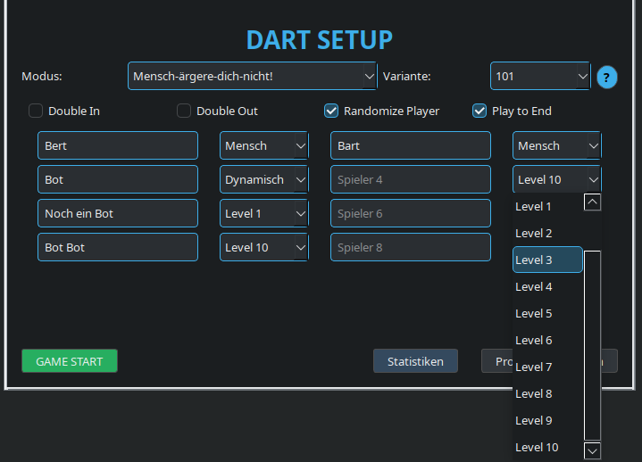
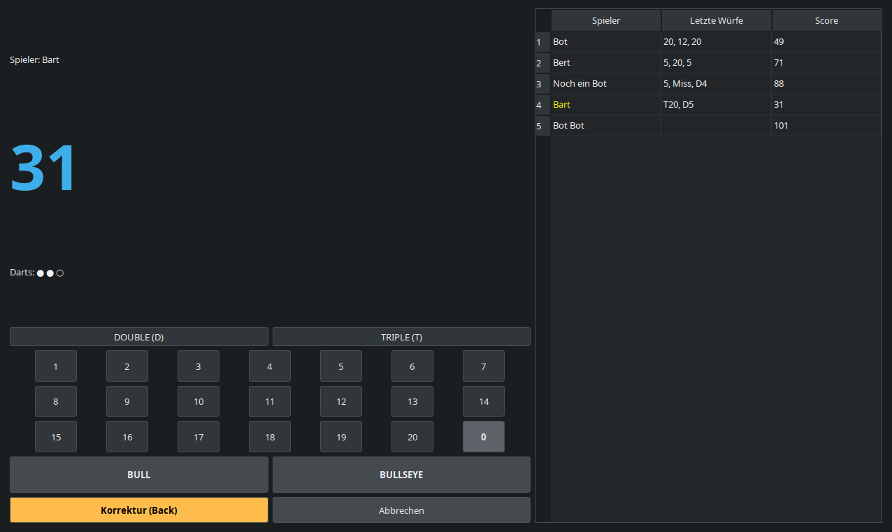
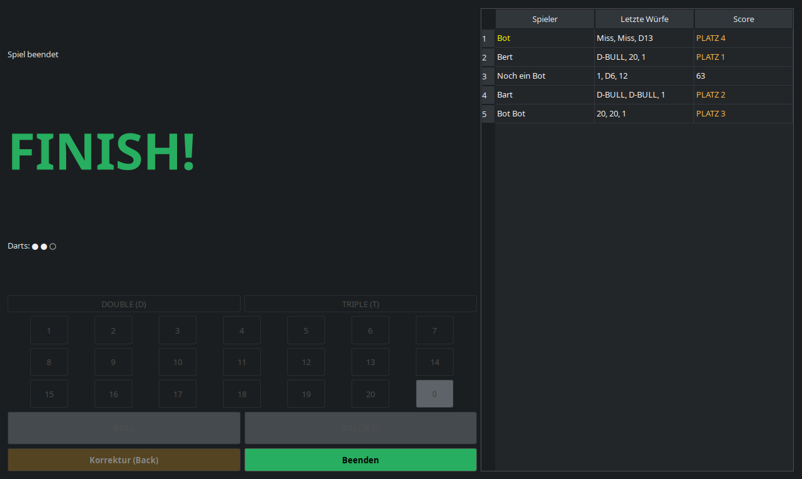
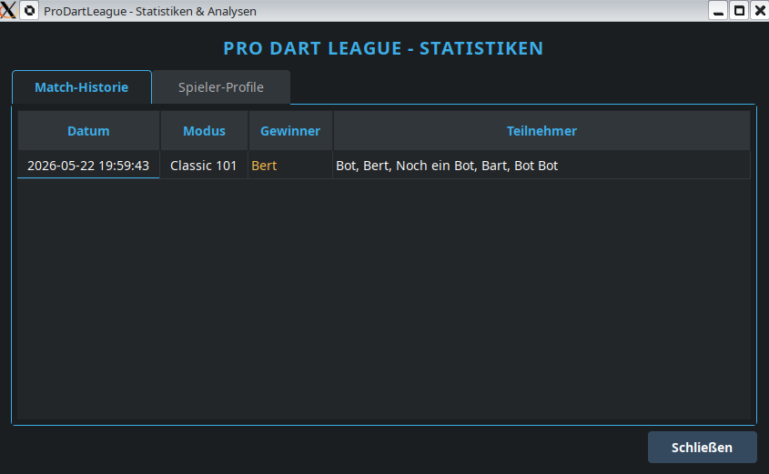
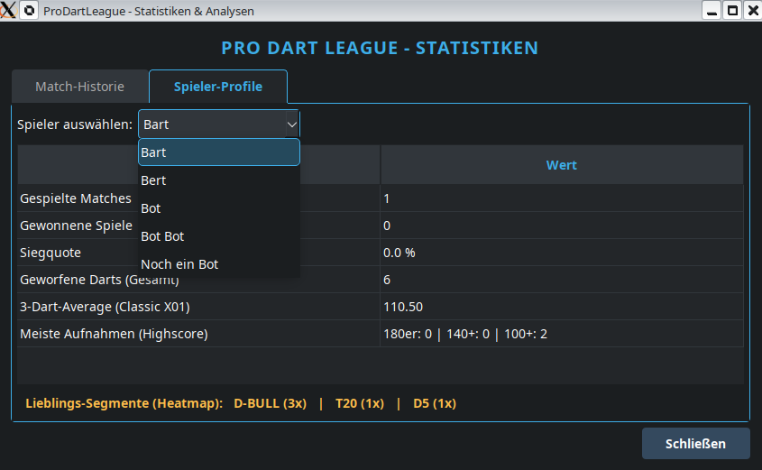
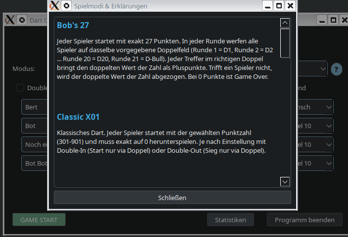

Die alte Version liegt 4 ever im legacy-mit Branch.

# Dart-Cup v02.06.26🎯

Ein schlankes und intuitives Dart-Scoreboard. Ursprünglich für Debian konzipiert, läuft es dank Python und PyQt6 plattformübergreifend auf nahezu jedem modernen Betriebssystem (und Windows :D).

### Features

* **Vielseitige Spielmodi**: Zehn verschiedene Varianten, darunter Klassiker wie X01, Cricket, Killer und Shanghai.
* **KI-Gegner**: Integriertes Bot-System mit zehn Schwierigkeitsgraden oder dynamischer Anpassung, inklusive Double-In/Out-Unterstützung.
* **Statistik-Analyse**: Automatisches Speichern aller Partien als JSON-Dateien zur detaillierten Auswertung im Statistik-Modul.
* **Effiziente Steuerung**: Bedienung per Maus oder bequem über Tastaturkürzel (0–9 sowie Tasten für Double/Triple).
* **Zuverlässigkeit**: Integriertes Logging-System zur einfachen Fehlerdiagnose in `logs/error.log`.

### Voraussetzungen

* **Python 3.11+**: Ohne geht es nicht.
* **PyQt6**: Das Framework für die grafische Benutzeroberfläche.

### Installation & Start

1. **Abhängigkeiten**: Stelle sicher, dass Python und PyQt6 installiert sind.
2. **Ausführen**: Starte die Anwendung einfach über `python3 dart-cup.py` (bzw. `python` unter Windows) im Hauptverzeichnis.

## Installation & Start  

### Debian:

### 1. Python installieren (falls nötig):
sudo apt update && sudo apt install -y python3

### 2. Abhängigkeiten installieren:
sudo apt update  
sudo apt install python3-pyqt6

### 3. starten:
Den Odrdner "Dart_Cup" downloaden, "dart-cup.py" ausführbar machen und im Ordner ein Terminal öffnen und ausführen:
python3 -B dart-cup.py

### 4. Desktopverknüpfung:
Kopiere dir die dart-cup.desktop aud dein Desktop, passe den Pfad zu deiner dart-cup.py an und mache die Desktop-Datei ausführbar.

### Windows11:
installiere den Python Install Manager, Fragen mit Y benatnworten  
drücke Win + R, tippe cmd ein und drücke Enter 
Befehle:  
python -m pip install --upgrade pip  
pip install PyQt6  
Datei "dart-cup.py" downloaden und ausführen  

