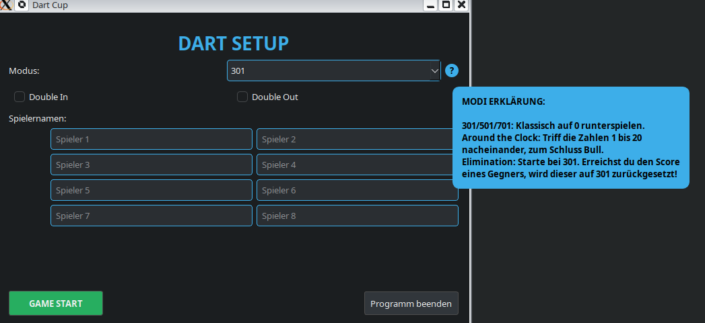
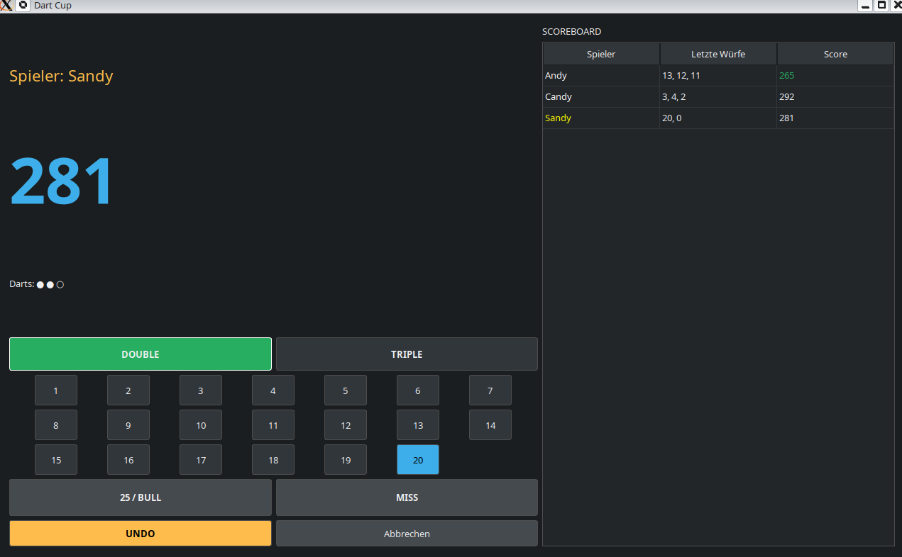

# Dart-Cup 🎯

Ein schlankes und intuitives Dart-Scoreboard. Ursprünglich für Debian (KDE Plasma) konzipiert, läuft es dank Python und PyQt6 auf nahezu jedem modernen Betriebssystem (und Windows :D).

## Features
*   **Vielseitige Spielmodi:** 301, 501, 701, Around the Clock und der berüchtigte **Elimination-Modus**.
*   **Regelwerk:** Optionale Unterstützung für Double In und Double Out.
*   **Multiplayer:** Bis zu 8 Spieler gleichzeitig.
*   **Intelligentes Scoreboard:** Automatische Platzierung, Highlight des Führenden und Erkennung von "Busts".
*   **Interaktive Hilfe:** Kleines Info-Icon im Setup mit Tooltips zu den einzelnen Spielvarianten.
*   **Undo-Funktion:** Ein Fehlwurf? Kein Problem, mit dem Undo-Button korrigierst du den letzten Pfeil.
*   **Konsequentes Ende:** Sobald das Spiel vorbei ist, wechselt der Abbruch-Button zu "Beenden" – für einen sauberen Abschluss.

## Voraussetzungen
*   **Python 3.8 oder höher:** Das Herzstück des Programms.
*   **PyQt6:** Das Framework für die grafische Benutzeroberfläche.

## Installation & Start
Unter **Debian**:

### 1. Python installieren (falls nötig):
sudo apt update && sudo apt install -y python3

### 2. Abhängigkeiten installieren:
sudo apt update
sudo apt install python3-pyqt6

### 3. starten:
Datei "dart-cup.py" downloaden und im Ordner ein Terminal öffnen und ausführen:
python3 dart-cup.py

### 4. Desktopverknüpfung:
Kopiere dir die dart-cup.desktop aud dein Desktop, passe den Pfad zu deiner dart-cup.py an und mache die Desktop-Datei ausführbar.

### Windows11:
installiere den Python Install Manager, Fragen mit Y benatnworten  
drücke Win + R, tippe cmd ein und drücke Enter 
Befehle:  
python -m pip install --upgrade pip  
pip install PyQt6  
Datei "dart-cup.py" downloaden und ausführen  

